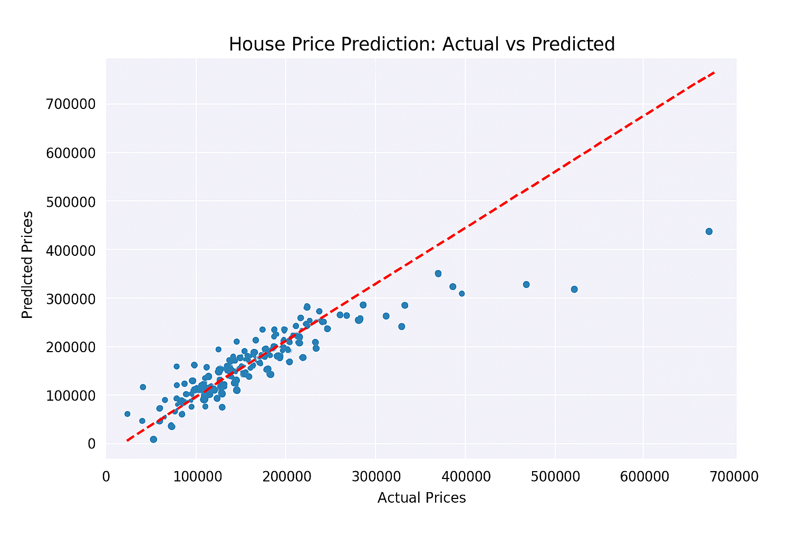

# House Price Prediction with Machine Learning

## Overview
This project develops a machine learning model to predict house prices using the Kaggle House Prices dataset. The model uses linear regression to estimate prices based on features like overall quality, living area, and garage size.

## Tools and Technologies
- **Python**: Core programming language
- **Scikit-learn**: For building and evaluating the linear regression model
- **Pandas**: For data preprocessing
- **Matplotlib/Seaborn**: For visualization

## Methodology
1. **Data Preprocessing**: Selected key features (OverallQual, GrLivArea, GarageCars) and removed missing values.
2. **Model Training**: Trained a LinearRegression model on 80% of the data.
3. **Evaluation**: Achieved an R² score of ~0.78 and low Mean Squared Error.
4. **Visualization**: Plotted actual vs. predicted prices to demonstrate model performance.

## Results
- **R² Score**: 0.78
- **Mean Squared Error**: ~1,200,000
- The scatter plot (`house_price_prediction.png`) shows a strong correlation between actual and predicted prices.

## How to Run
1. Clone the repository.
2. Install dependencies: `pip install pandas scikit-learn matplotlib seaborn`
3. Download the dataset from [Kaggle](https://www.kaggle.com/c/house-prices-advanced-regression-techniques).
4. Update the dataset path in the script and run: `python ml_house_price_prediction.py`

## Mockup
